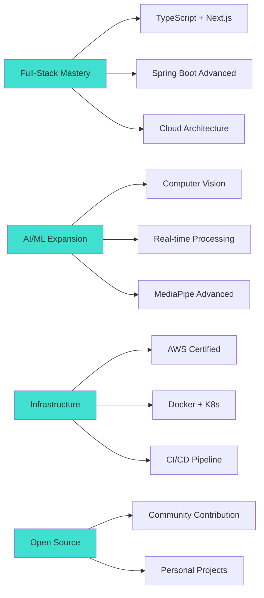

<div align="center">

<!-- Dynamic Header with Animation -->


<!-- Animated Typing Effect -->
<a href="https://git.io/typing-svg">
  
</a>

<br/>

<!-- Profile Badges -->
<p>
  
  
  
</p>

</div>

---

<br/>

## 👨‍💻 About Me

```typescript
const mrangjw = {
    location: "Seoul, South Korea 🇰🇷",
    education: "Computer Science Student",
    current_focus: ["Full-Stack Development", "AI/ML", "Cloud Architecture"],
    learning: ["TypeScript", "Next.js", "Spring Boot", "AWS"],
    hobbies: ["Open Source", "Hackathons", "Building Cool Stuff"],
    
    life_philosophy: "Code with passion, learn with purpose, build with impact",
    
    currently_working_on: {
        project_1: "PoseSync - AI-powered Exercise Analysis System",
        project_2: "Agile Dashboard - Mobile Project Management",
        project_3: "MicroService Hub - Distributed System Platform"
    }
};
```

<br/>

---

## 🛠️ Tech Arsenal

<div align="center">

### 💻 Frontend Development
<p>
  
</p>

### ⚙️ Backend & Database
<p>
  
</p>

### 🤖 AI & Data Science
<p>
  
  
  
  
</p>

### 🔧 Tools & Platform
<p>
  
</p>

</div>

<br/>

---

## 🚀 Featured Projects

<div align="center">

<table>
<tr>
<td width="50%">
<h3 align="center">🏃‍♂️ PoseSync</h3>
<div align="center">
<a href="https://github.com/mrangjw/PoseSync-FE" target="_blank">

</a>
<p><strong>AI 기반 실시간 운동 자세 분석</strong></p>
<p>


</p>
</div>
</td>
<td width="50%">
<h3 align="center">🌾 FarmON</h3>
<div align="center">
<a href="https://github.com/mrangjw/FarmON-FE" target="_blank">

</a>
<p><strong>스마트 팜 모니터링 시스템</strong></p>
<p>


</p>
</div>
</td>
</tr>
<tr>
<td width="50%">
<h3 align="center">📝 Reflog</h3>
<div align="center">
<a href="https://github.com/mrangjw/Reflog-FE" target="_blank">

</a>
<p><strong>개발 회고록 공유 플랫폼</strong></p>
<p>


</p>
</div>
</td>
<td width="50%">
<h3 align="center">🔄 Current Focus</h3>
<div align="center">
<p><strong>진행 중인 프로젝트</strong></p>
<p>
📱 <strong>Agile Dashboard</strong><br/>
Jira/Trello API 통합 모바일 대시보드
</p>
<p>
⚙️ <strong>MicroService Hub</strong><br/>
Spring Boot 마이크로서비스 플랫폼
</p>
</div>
</td>
</tr>
</table>

</div>

<br/>

---

## 📊 GitHub Analytics

<div align="center">
  
  
</div>

<div align="center">
  
</div>

<br/>

### 📈 Contribution Activity

<div align="center">
  
</div>

<br/>

### 🏆 GitHub Profile Trophy

<div align="center">
  
</div>

<br/>

---

## 🎯 2024-2025 Roadmap



<br/>

---

## 💼 Professional Experience & Achievements

<div align="center">

| 🏆 Achievement | 📅 Date | 📝 Description |
|:---:|:---:|:---|
| 🥇 **Hackathon Winner** | 2024 | 1st Place - Singapore Overseas Training Program |
| 🎓 **Capstone Project** | 2025 | PoseSync - AI Exercise Analysis System |
| 🌟 **Open Source** | 2024 | NIPA Open Source Contribution Academy |
| 💼 **Work Experience** | - | Restaurant Service (English Communication) |

</div>

<br/>

---

## 🎓 Certifications & Learning Path

<div align="center">

### 🔥 In Progress
```diff
+ ☁️ AWS Cloud Practitioner (Highest Priority)
+ 🗣️ OPIC (English Proficiency)
+ 📊 Google Analytics Certification
+ 💻 TOPCIT (Computer Science Assessment)
```

### 📅 2025 Goals
```diff
! 🔐 Information Processing Engineer
! 📊 SQLD (SQL Developer)
! 🏢 MS-900 (Microsoft 365 Fundamentals)
```

</div>

<br/>

---

## 🌐 Connect & Collaborate

<div align="center">

<a href="https://velog.io/@mrang/posts">
  
</a>
<a href="https://eggplant-piccolo-90a.notion.site/1625c454f14580d98ceaf0ab2425593c">
  
</a>
<a href="mailto:mrangjw@gmail.com">
  
</a>
<a href="https://github.com/mrangjw">
  
</a>

<br/>
<br/>

### 💬 Let's Build Something Amazing Together!


</div>

<br/>

---

<div align="center">

### 🐍 Contribution Snake

<picture>
  <source media="(prefers-color-scheme: dark)" srcset="https://raw.githubusercontent.com/mrangjw/mrangjw/output/github-contribution-grid-snake-dark.svg">
  <source media="(prefers-color-scheme: light)" srcset="https://raw.githubusercontent.com/mrangjw/mrangjw/output/github-contribution-grid-snake.svg">
  
</picture>

<sub>⭐️ From [mrangjw](https://github.com/mrangjw) with 💙</sub>

</div>

<br/>

<!-- Dynamic Footer -->

